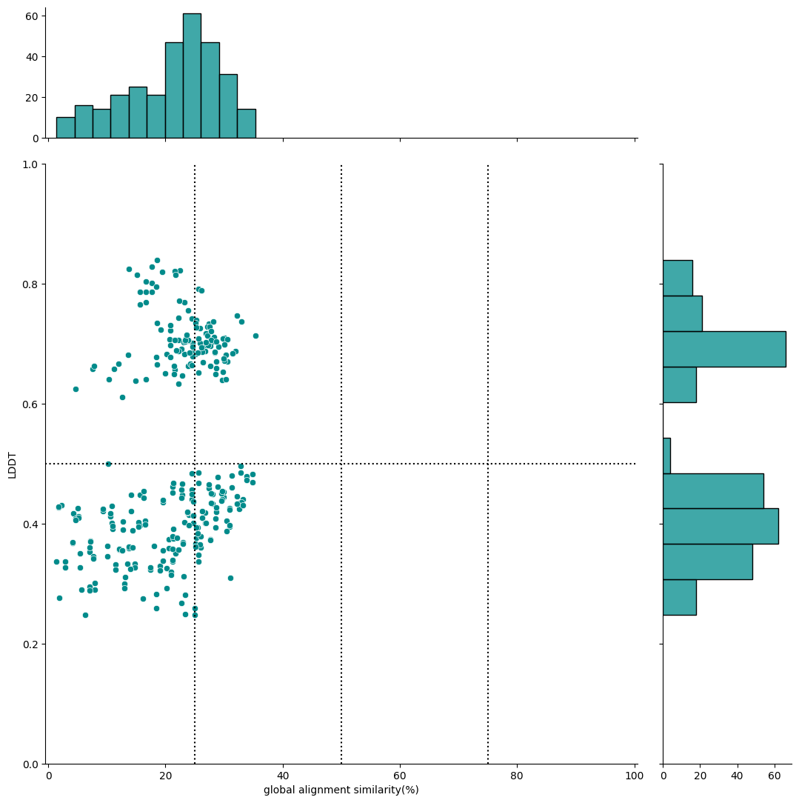
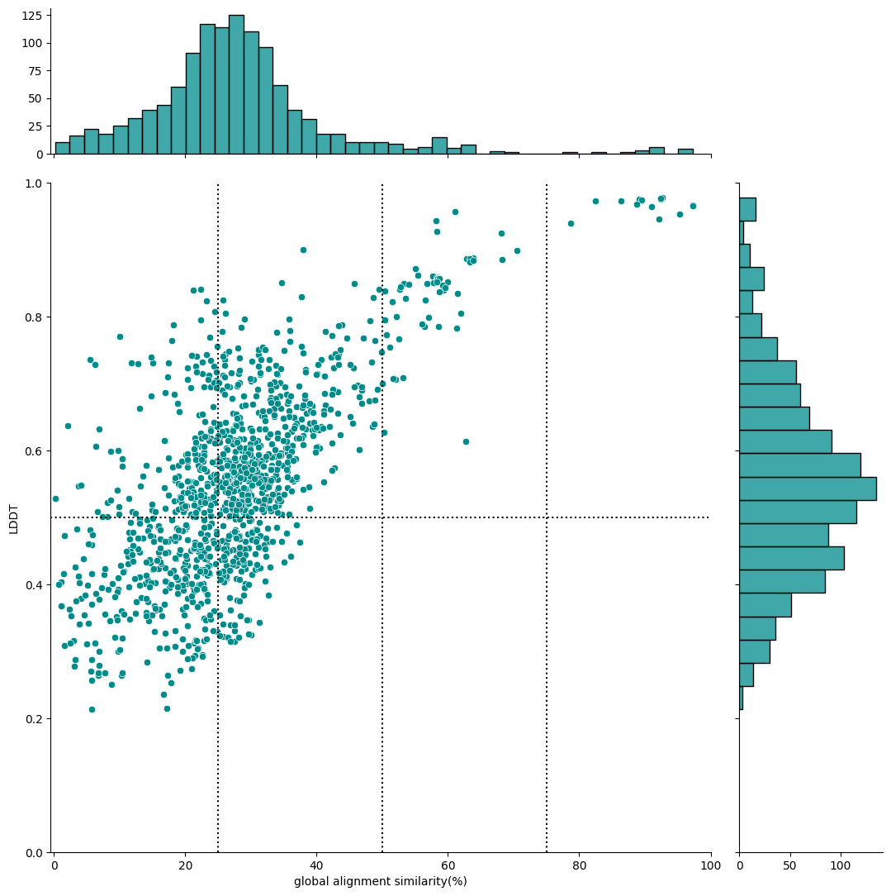

# plant2human workflow


[](https://github.com/common-workflow-language/cwltool/releases/tag/3.1.20250110105449)
[](./LICENSE)
[](https://github.com/yonesora56/plant2human/releases/tag/v1.0.1)
[](https://github.com/yonesora56/plant2human/tree/main/.devcontainer)
[](https://x.com/sorayone56)


This analysis workflow is centered on [foldseek](https://github.com/steineggerlab/foldseek), which enables fast structural similarity searches and supports the discovery of understudied genes by comparing plants, which are distantly related species, with humans, for which there is a wealth of information.
Based on the list of genes you are interested in, you can easily create a scatter plot of **“structural similarity vs. sequence similarity”** by retrieving structural data from the [AlphaFold protein structure database](https://alphafold.ebi.ac.uk/).

&nbsp;

&nbsp;

## report

- 2025-02-02: fix foldseek easy-search process

&nbsp;

## Implementation Background

In recent years, with the [AlphaFold protein structure database](https://alphafold.ebi.ac.uk/), it has become easier to obtain protein structure prediction data and perform structural similarity searches even for plant species such as rice. Against this background, searching for hits with **“low sequence similarity and high structural similarity”** for the gene groups being focused on has become possible. This approach may allow us to discover proteins that are conserved in distantly related species and to consider the characteristics of these proteins based on the wealth of knowledge we have about humans.

&nbsp;

## Analysis Environment

### **1. Using Dev Containers (Docker and VScode extension)**

Most processes, such as Foldseek, use container (BioContainers), but some involve processing with jupyter notebook, which requires the preparation of some python libraries (e.g., polars.).
If you want to experiment with a simple workflow, you can create an analysis environment easily using [Dev Containers](./.devcontainer/devcontainer.json) system, a VScode extension.
Using this environment, the version of the python library is probably the one used during development, so errors are unlikely to occur (see [Dockerfile](./.devcontainer/Dockerfile) for the package version).

Please check the official website for Dev Container details.
- [Developing inside a Container](https://code.visualstudio.com/docs/devcontainers/containers)
- [Development Containers](https://containers.dev/)

&nbsp;

### **2. Executing with cwltool**

This analysis workflow is tested using [cwltool](https://github.com/common-workflow-language/cwltool) version 3.1.20250110105449.

&nbsp;

&nbsp;

## Example 1 ( *Oryza sativa* vs *Homo sapiens*)

Here, we will explain how to use the list of 10 rice genes as an example.

### **1. Creation of a TSV file of gene and UniProt ID correspondences**

First, you need the following [gene list tsv file](./test/oryza_sativa_test/oryza_sativa_random_gene_list.tsv). (Please set the column name as "From")

```tsv
From
Os01g0187600
Os12g0129300
Os12g0159500
Os02g0609000
Os05g0468600
Os05g0352750
Os06g0140700
Os04g0391500
Os01g0795250
Os01g0859200
```

The following [TSV file](./test/oryza_sativa_test/rice_random_gene_idmapping_all.tsv) is required to execute the following workflow. 

```tsv
From	UniProt Accession
Os01g0187600	A0A0P0UZ77
Os12g0129300	A0A0P0Y6G7
Os12g0129300	B9GBP4
Os12g0159500	A0A0P0Y794
Os12g0159500	A0A8J8YJ44
Os12g0159500	B9GBZ8
...
```
To do this, you need to follow the CWL workflow command below.
This [yaml file](./job/uniprot_idmapping_job_example_os.yml) is the parameter file for the workflow, for example.

```bash
cwltool --debug --outdir ./test/oryza_sativa_test ./Tools/01_uniprot_idmapping.cwl ./job/uniprot_idmapping_job_example_os.yml
```
In this execution, [mmcif files](./test/oryza_sativa_test/rice_random_gene_mmcif) are also retrieved.
The execution results are output with the [jupyter notebook](./test/oryza_sativa_test/rice_random_gene_uniprot_idmapping.ipynb).

&nbsp;

&nbsp;

### **2. Creating and Preparing Indexes**

I'm sorry, but the [main workflow](./Workflow/plant2human_v1.0.1.cwl) does not currently include the creation of an index process (both for foldseek index and BLAST index).
Please perform the following processes in advance.

#### 2-1. Creating a Foldseek Index

In this workflow, the target of the structural similarity search is specified as the AlphaFold database to perform comparisons across a broader range of species.
Index creation using the `foldseek databases` command is through the following command.

Please select the database you want to use from `Alphafold/UniProt,` `Alphafold/UniProt50-minimal`, `Alphafold/UniProt50`, `Alphafold/Proteome,` `Alphafold/Swiss-Prot.`
You can check the details of this database using the following command.

```bash
docker run --rm quay.io/biocontainers/foldseek:9.427df8a--pl5321h5021889_2 foldseek databases --help
```

For example, if you want to specify AlphaFold/Swiss-Prot as the index, you can do so with the following command,

```bash
# using docker container
docker run -u $(id -u):$(id -g) --rm -v $(pwd):/home -e HOME=/home --workdir /home quay.io/biocontainers/foldseek:9.427df8a--pl5321h5021889_2 foldseek databases Alphafold/Swiss-Prot swissprot tmp --threads 8

# making directory
mkdir ./index/index_swissprot

# moving index file
mv swissprot* ./index/index_swissprot/
```
**Note:** We have written a [CWL file describing the above process](./Tools/02_foldseek_database.cwl), but we have confirmed an error and are correcting it.

&nbsp;

#### 2-2. Downloading a BLAST Index File

An index FASTA file must be downloaded to obtain the amino acid sequence using the `blastdbcmd` command from the UniProt database.
Since it is a rice and human comparison, it can be downloaded as follows.

```bash
# Oryza sativa (all uniprot entries)
curl -o uniprotkb_39947_all.fasta.gz "https://rest.uniprot.org/uniprotkb/stream?compressed=true&format=fasta&query=%28organism_id%3A39947%29"

gzip -d uniprotkb_39947_all.fasta.gz

# Homo sapiens (all uniprot entries)
curl -o uniprotkb_9606_all.fasta.gz "https://rest.uniprot.org/uniprotkb/stream?compressed=true&format=fasta&query=%28organism_id%3A9606%29"

gzip -d uniprotkb_9606_all.fasta.gz
```

&nbsp;

### 3. Execution of the [Main Workflow](./Workflow/plant2human.cwl)

In this process, we perform a structural similarity search using the `foldseek easy-search` command and then perform a pairwise alignment of the amino acid sequences of the hit pairs using the `needle` and `water` commands.
Finally, based on this information, we create a scatter plot and output a [jupyter notebook](./test/oryza_sativa_test/plant2human_report.ipynb) as a report.
Examples of commands are as follows.

```bash
cwltool --debug --outdir ./test/oryza_sativa_test ./Workflow/plant2human.cwl ./job/plant2human_job_example_os.yml
```

&nbsp;

For example, you can visualize the results of structural similarity and global alignment, as shown below.
In this case, the x-axis represents the global alignment similarity match (%), and the y-axis represents the LDDT score (an indicator of structural alignment).



&nbsp;

The following scatter diagram can also be obtained from the test results of [Zey Mays random 100 genes vs. Homo sapiens](./test/zea_mays_test).



&nbsp;