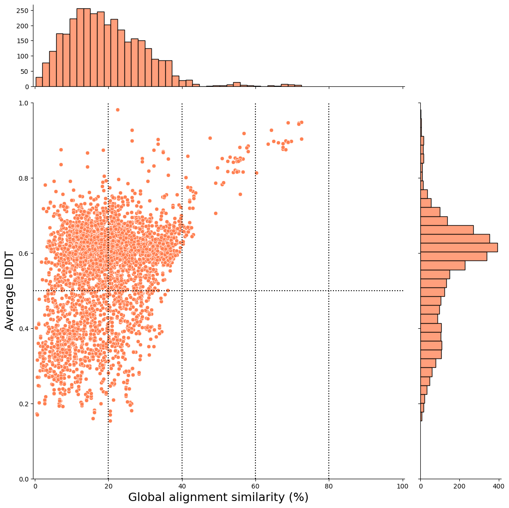
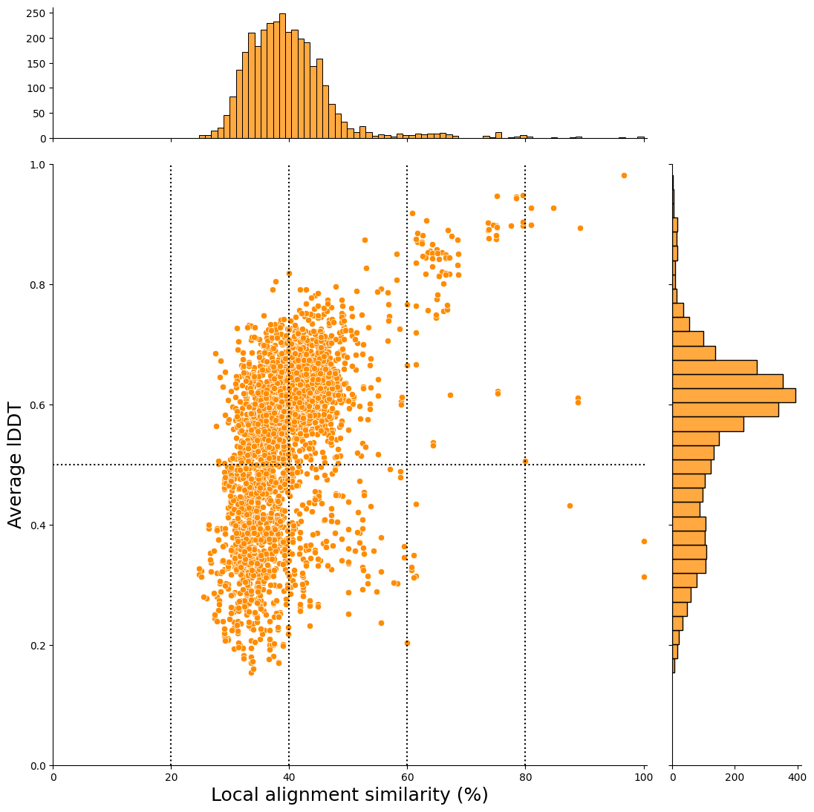
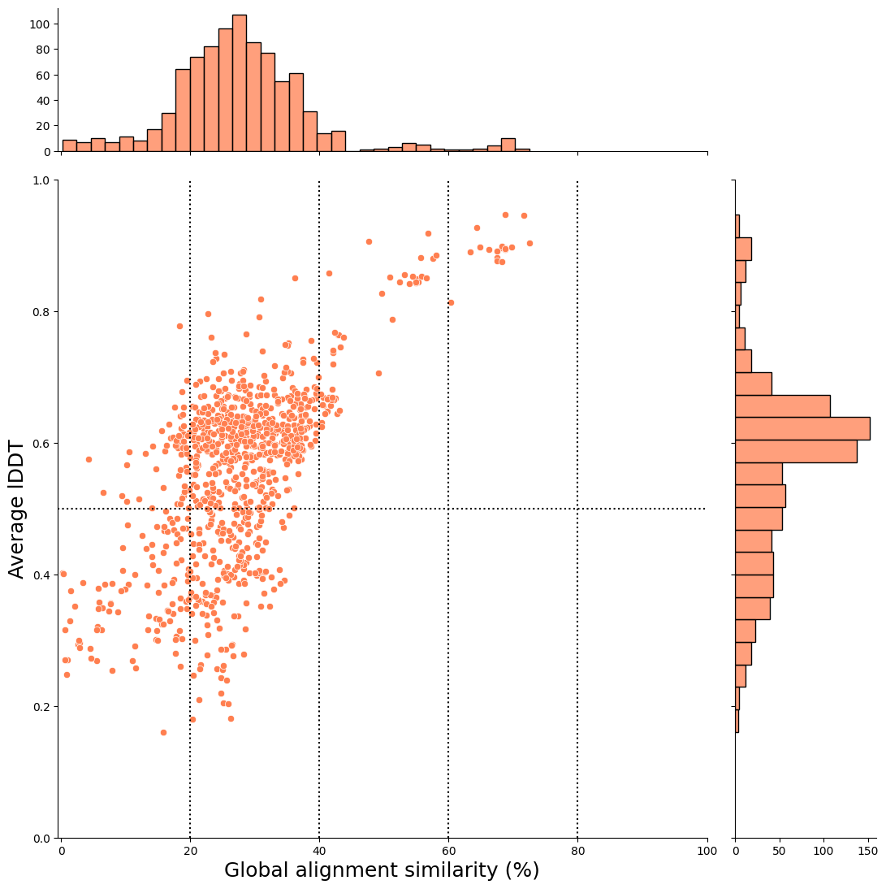

# plant2human workflow


[](https://github.com/common-workflow-language/cwltool/releases/tag/3.1.20250110105449)
[](./LICENSE)
[](https://github.com/yonesora56/plant2human/releases/tag/v1.0.1)
[](https://github.com/yonesora56/plant2human/tree/main/.devcontainer)
[](https://x.com/sorayone56)

## Introduction

This analysis workflow is centered on [foldseek](https://github.com/steineggerlab/foldseek), which enables fast structural similarity searches and supports the discovery of understudied genes by comparing plants, which are distantly related species, with humans, for which there is a wealth of information.
Based on the list of genes you are interested in, you can easily create a scatter plot of **“structural similarity vs. sequence similarity”** by retrieving structural data from the [AlphaFold protein structure database](https://alphafold.ebi.ac.uk/).

&nbsp;

## Report

- 2025-02-02: fix `foldseek easy-search` command process
- 2025-09-02: update `makeblstadb` command process

&nbsp;

&nbsp;

## Implementation Background

In recent years, with the [AlphaFold protein structure database](https://alphafold.ebi.ac.uk/), it has become easier to obtain protein structure prediction data and perform structural similarity searches even for plant species such as rice. Against this background, searching for hits with **“low sequence similarity and high structural similarity”** for the gene groups being focused on has become possible. This approach may allow us to discover proteins that are conserved in distantly related species and to consider the characteristics of these proteins based on the wealth of knowledge we have about humans.

&nbsp;

&nbsp;

## Analysis Environment

### **1. Using Dev Containers (Docker and VScode extension)**

Most processes, such as Foldseek, use container ([BioContainers](https://quay.io/organization/biocontainers)), but some involve processing with jupyter notebook, which requires the preparation of some python libraries (e.g., polars.).
If you want to experiment with a simple workflow, you can create an analysis environment easily using [Dev Containers](./.devcontainer/devcontainer.json) system, a VScode extension.
Using this environment, the version of the python library is probably the one used during development, so errors are unlikely to occur (see [Dockerfile](./.devcontainer/Dockerfile) for the package version).

Please check the official website for Dev Container details.
- [Developing inside a Container](https://code.visualstudio.com/docs/devcontainers/containers)
- [Development Containers](https://containers.dev/)

&nbsp;

### **2. Executing with cwltool**

This analysis workflow is tested using [cwltool](https://github.com/common-workflow-language/cwltool) version 3.1.20250110105449.

&nbsp;

### **3. Python Environment**

I've already checked python package version below.
Using “Devcontainers” makes it easy to reproduce your execution environment.

```python3
python==3.11
polars==1.17.1
matplotlib==3.8.2
seaborn==0.13.2
unipressed==1.4.0
papermill==2.6.0
```

&nbsp;

&nbsp;

## Example 1 ( *Oryza sativa 100 genes* vs *Homo sapiens*)

Here, we will explain how to use the list of 10 rice genes as an example.

&nbsp;

### **1. Creation of a TSV file of gene and UniProt ID correspondences**

First, you need the following [gene list tsv file](./test/oryza_sativa_test_100genes_202509/oryza_sativa_random_100genes_list.tsv). (Please set the column name as "From")

```tsv
From
Os12g0269700
Os10g0410900
Os05g0403000
Os06g0127250
Os02g0249600
Os09g0349700
Os03g0735150
Os08g0547350
Os06g0282400
Os05g0576750
Os07g0216600
Os10g0164500
Os07g0201300
Os01g0567200
Os05g0563050
Os03g0660050
Os11g0436450
...
```

The following [TSV file](./test/oryza_sativa_test_100genes_202509/os_100_genes_idmapping_all.tsv) is required to execute the following workflow. 

```tsv
From	UniProt Accession
Os01g0104800	A0A0N7KC66
Os01g0104800	Q657Z6
Os01g0104800	Q658C6
Os01g0152300	Q9LGI2
Os01g0322300	A0A9K3Y6N1
Os01g0322300	Q657N1
Os01g0567200	A0A0N7KD66
Os01g0567200	Q657K0
Os01g0571133	A0A0P0V4A8
Os01g0664500	A0A8J8XFG3
Os01g0664500	Q5SN58
Os01g0810800	A0A8J8XDQ1
Os01g0810800	B7FAC9
Os01g0875300	A0A0P0VB72
Os01g0924300	A0A0P0VCB7
...
```
To do this, you need to follow the CWL workflow command below.
This [yaml file](./job/oryza_sativa_100_genes/os_uniprot_idmapping.yml) is the parameter file for the workflow, for example.

```bash
cwltool --debug --outdir ./test/oryza_sativa_test_100genes_202509/ ./Tools/01_uniprot_idmapping.cwl ./job/oryza_sativa_100_genes/os_uniprot_idmapping.yml
```
In this execution, [mmcif files](./test/oryza_sativa_test_100genes_202509/os_100_genes_mmcif) are also retrieved.
The execution results are output with the [jupyter notebook](./test/oryza_sativa_test_100genes_202509/oryza_sativa_100_genes_uniprot_idmapping.ipynb).

**Note**: Network access required in this process!

&nbsp;

&nbsp;

### **2. Creating and Preparing Indexes**

I'm sorry, but the [main workflow](./Workflow/plant2human_v1.0.1.cwl) does not currently include the creation of an index process (both for foldseek index and BLAST index).
Please perform the following processes in advance.

&nbsp;

#### 2-1. Creating a Foldseek Index for structural alignment

In this workflow, the target of the structural similarity search is specified as the AlphaFold database to perform comparisons across a broader range of species.
Index creation using the `foldseek databases` command is through the following command.

Please select the database you want to use from `Alphafold/UniProt,` `Alphafold/UniProt50-minimal`, `Alphafold/UniProt50`, `Alphafold/Proteome,` `Alphafold/Swiss-Prot.`

```python
# Supported databases in this workflow
Alphafold/UniProt
Alphafold/UniProt50-minimal
Alphafold/UniProt50
Alphafold/Proteome
Alphafold/Swiss-Prot
```

&nbsp;

You can check the details of this database using the following command.

```bash
docker run --rm quay.io/biocontainers/foldseek:9.427df8a--pl5321h5021889_2 foldseek databases --help
```

For example, if you want to specify AlphaFold/Swiss-Prot as the index, you can do so with the following CWL file;

```bash
# execute creation of foldseek index using "foldseek databases"
cwltool --debug --outdir ./index/ ./Tools/02_foldseek_database.cwl \
--database Alphafold/Swiss-Prot \
--index_dir_name index_swissprot \
--index_name swissprot \
--threads 16
```
**Note:**: urrently, this index creation process is not incorporated into the main analysis workflow (plant2human workflow). 
This is because the process requires network access, and maybe to be able to respond immediately if there are any changes to the tool requirements.

&nbsp;

&nbsp;

#### 2-2. Creating a BLAST Index for sequence alignment

An index FASTA file must be downloaded to obtain the amino acid sequence using the `blastdbcmd` command from the AlphaFold Protein Structure Database. This workflow uses the version of the protein sequence that was used for structure prediction.

Download URL: https://ftp.ebi.ac.uk/pub/databases/alphafold/sequences.fasta

**Note:**: This FASTA file is extremely large (**92GB**), so it's probably best to delete it after creating the index.

```bash
# Preparation for BLAST index
mkdir cwl_cache
cd ./index
curl -O https://ftp.ebi.ac.uk/pub/databases/alphafold/sequences.fasta
mv sequences.fasta afdb_all_sequneces.fasta
```

&nbsp;

```bash
# execute creation of BLAST index using "makeblastdb"
mv ../
cwltool --debug --cachedir ./cwl_cache/ --outdir ./index/ ./Tools/14_makeblastdb_v2.cwl
```

**Note:**: It is estimated to take 2 hours for creating index. We are currently investigating whether it can be executed by another method.

&nbsp;

&nbsp;

### 3. Execution of the [Main Workflow](./Workflow/plant2human.cwl)

In this process, we perform a structural similarity search using the `foldseek easy-search` command and then perform a pairwise alignment of the amino acid sequences of the hit pairs using the `needle` and `water` commands.
Finally, based on this information, we create a scatter plot and output a [jupyter notebook](./test/oryza_sativa_test_100genes_202509/os_100_genes_plant2human_report.ipynb) as a report.
Examples of commands are as follows.

```bash
cwltool --debug --outdir ./test/oryza_sativa_test_100genes_202509/ ./Workflow/plant2human_v2.cwl ./job/oryza_sativa_100_genes/plant2human_job_example_os100.yml
```

&nbsp;

For example, you can visualize the results of structural similarity and global alignment, as shown below.
In this case, the x-axis represents the global alignment similarity match (%), and the y-axis represents the average lDDT score (an indicator of structural alignment).

The hit pairs in the upper-right plot indicate higher sequence similarity and structural similarity.



&nbsp;

In this case, the x-axis represents the local alignment similarity match (%), and the y-axis represents the average lDDT score (an indicator of structural alignment).



&nbsp;

&nbsp;

### After Filtering

The report notebook for the plant2human workflow also outputs scatter plots after applying the filtering conditions set in this workflow.

#### Filtering criteria

1. structural alignment coverage >= 50%
2. If there are hits with the same target for the same gene-derived UniProt ID, the one with the highest qcov is selected, and if the qcov is the same, the one with the highest lDDT is selected.

    **Note that in this study, we leave the states with the same foldseek hit even if the rice genes are different.**

3. Select hits that can be converted to Ensembl gene id and HGNC Gene nomenclature with TogoID API

&nbsp;

By applying these filtering conditions, you can examine hit pairs that are easier to investigate!

&nbsp;

##### Global alignment



&nbsp;

##### local alignment

