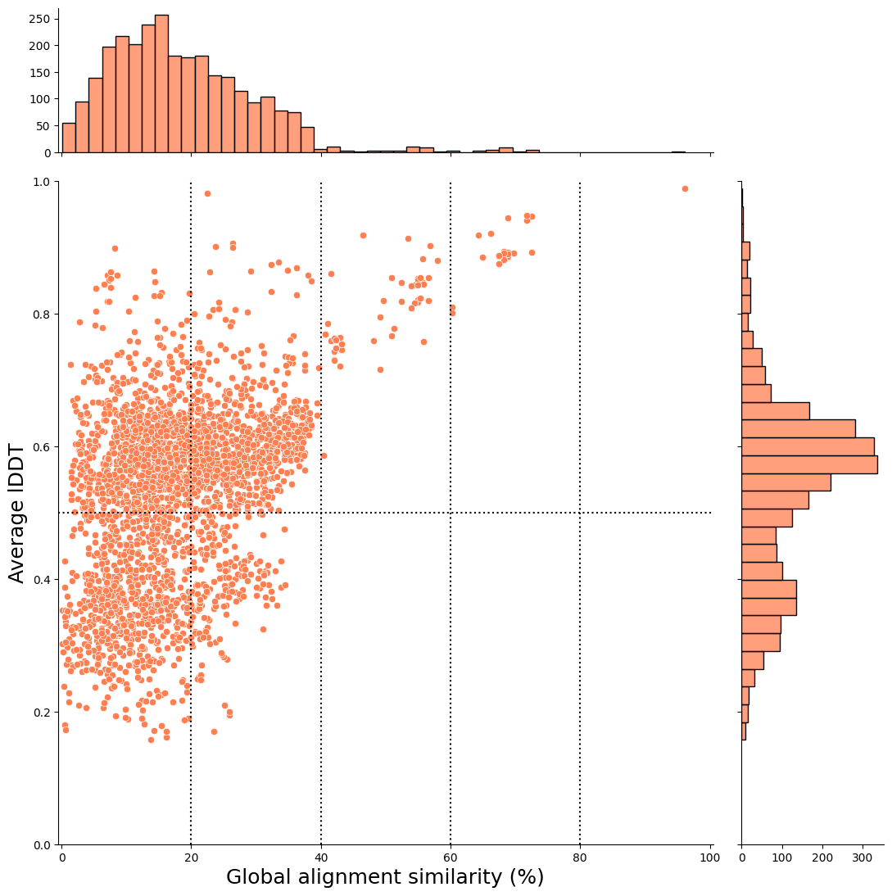
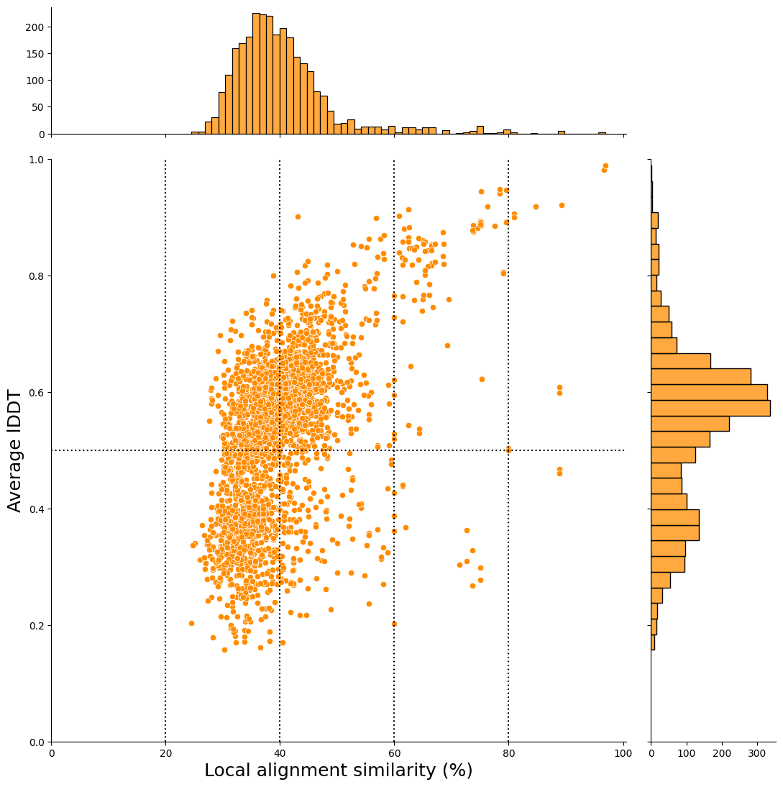
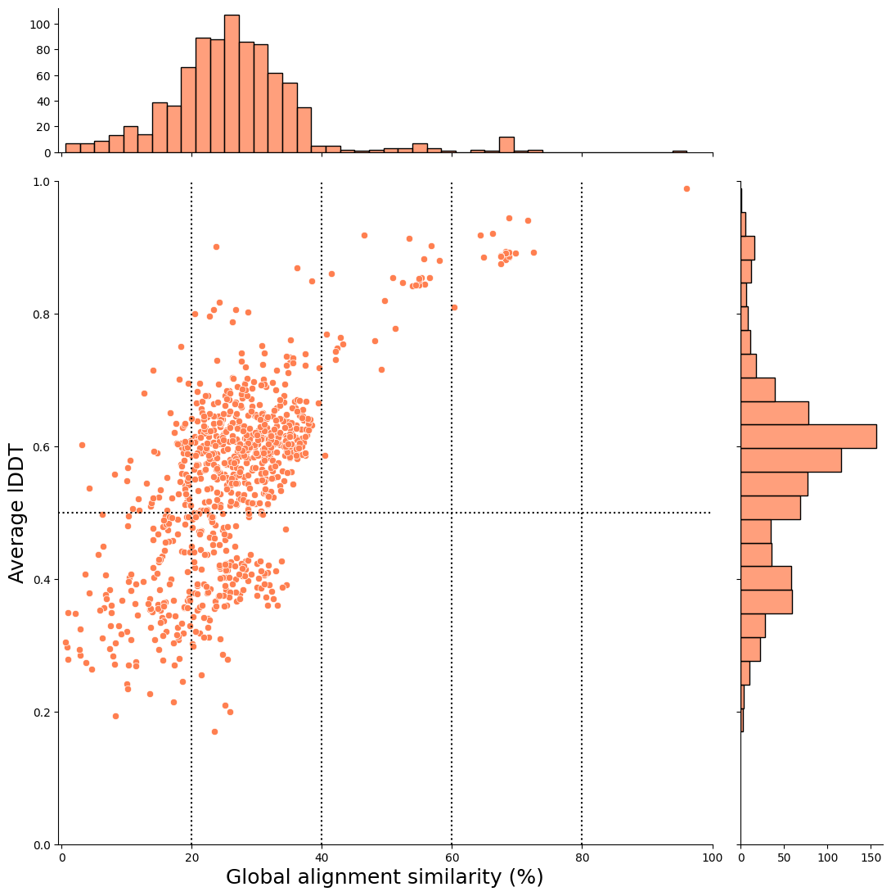
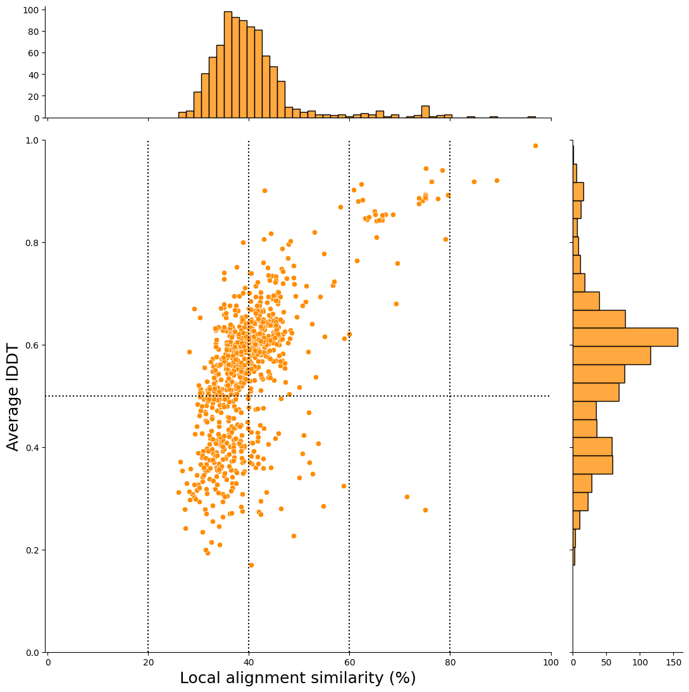

# plant2human workflow 🌾 ↔ 🕺


[](https://github.com/common-workflow-language/cwltool/releases/tag/3.1.20250110105449)
[](./LICENSE)
[](https://github.com/yonesora56/plant2human/releases/tag/v2.0)
[](https://github.com/yonesora56/plant2human/tree/main/.devcontainer)
[](https://x.com/sorayone56)

## Introduction

This analysis workflow is centered on [foldseek](https://github.com/steineggerlab/foldseek), which enables fast structural similarity searches and supports the discovery of understudied genes by comparing plants, which are distantly related species, with humans, for which there is a wealth of information.
Based on the list of genes you are interested in, you can easily create a scatter plot of **“structural similarity vs. sequence similarity”** by retrieving structural data from the [AlphaFold protein structure database (AFDB)](https://alphafold.ebi.ac.uk/).

&nbsp;

&nbsp;

## 📣 Report

- ✔ 2025-02-02: fix `foldseek easy-search` command process
- ✔ 2025-09-02: update `makeblstadb` command process
- ✔ 2025-09-28: main workflow update! `plant2human_v2.cwl`
- ✔ 2025-12-13: main workflow update! [`plant2human_v3_stringent.cwl` (recommend)](./Workflow/plant2human_v3_stringent.cwl) and [`plant2human_v3_permissive.cwl`](./Workflow/plant2human_v3_permissive.cwl)
- ✔ 2025-12-13: Add *Arabidopsis thaliana* 100 genes (Ensembl plants release 62) test example ([details](./test/arabidopsis_test_100genes_202512/README.md))
- ✔ 2025-12-13: Add *Zea mays* 100 genes (Ensembl plants release 62) test example ([details](./test/zea_mays_test_100genes_202512/README.md))
- ✔ 2025-12-13: Add *Solanum lycopersicum* 100 genes (Ensembl plants release 62) test example ([details](./test/solanum_lycopersicum_test_100genes_202512/README.md))
- ✔ 2025-12-13: Add *Glycine max* 100 genes (Ensembl plants release 62) test example ([details](./test/glycine_max_test_100genes_202512/README.md))

&nbsp;

&nbsp;

## 🔧 Implementation Background

In recent years, with the [AlphaFold protein structure database](https://alphafold.ebi.ac.uk/), it has become easier to obtain protein structure prediction data and perform structural similarity searches even for plant species such as rice. Against this background, searching for hits with **“low sequence similarity and high structural similarity”** for the gene groups being focused on has become possible. This approach may allow us to discover proteins that are conserved in distantly related species and to consider the characteristics of these proteins based on the wealth of knowledge we have about humans.

&nbsp;

&nbsp;

## 📈 Analysis Environment

### Prerequisites

- Docker / Orbstack
- [`cwltool`](https://github.com/common-workflow-language/cwltool) >= 3.1.20250110105449

&nbsp;

### ⚠️  Prerequisites (Python Environment)

I've already checked python 3.11 and packages version below. 
Please install the following packages beforehand!

(Using “Devcontainers” makes it easy to reproduce your execution environment!)

```python3
polars==1.17.1
matplotlib==3.8.2
seaborn==0.13.2
unipressed==1.4.0
papermill==2.6.0
```

&nbsp;

### **Using Dev Containers (Docker and VScode extension)**

Most processes, such as Foldseek, use container ([BioContainers](https://quay.io/organization/biocontainers)), but some involve processing with jupyter notebook, which requires the preparation of some python libraries (e.g., polars.).
If you want to experiment with a simple workflow, you can create an analysis environment easily using [Dev Containers](./.devcontainer/devcontainer.json) system, a VScode extension.
Using this environment, the version of the python library is probably the one used during development, so errors are unlikely to occur (see [Dockerfile](./.devcontainer/Dockerfile) for the package version).

Please check the official website for Dev Container details.
- [Developing inside a Container](https://code.visualstudio.com/docs/devcontainers/containers)
- [Development Containers](https://containers.dev/)

&nbsp;

### The machine used for testing (2025-12-15)

- Machine: 🍎 MacBook Pro 🍎
- Chip: Apple M3 Max
- memory: 128 GB

&nbsp;

&nbsp;

&nbsp;

## 🌾 Analysis Example ( *Oryza sativa subsp.japonica* 100 genes vs *Homo sapiens*) 🌾

Here, we will explain how to use the list of 100 rice genes as an example.

&nbsp;

## 0. Clone Repository

```bash
git clone https://github.com/yonesora56/plant2human.git
cd ./plant2human/
```

&nbsp;

## 1. Creation of a TSV file of gene and UniProt ID correspondences 🧬

First, you need the following [gene list tsv file](./test/oryza_sativa_test_100genes_202512/oryza_sativa_random_100genes_list.tsv). 

**📝 Note:** Please set the column name as "From"

```tsv
From
Os12g0269700
Os10g0410900
Os05g0403000
Os06g0127250
Os02g0249600
Os09g0349700
Os03g0735150
Os08g0547350
Os06g0282400
Os05g0576750
Os07g0216600
Os10g0164500
Os07g0201300
Os01g0567200
Os05g0563050
Os03g0660050
Os11g0436450
...
```

&nbsp;

The following [TSV file](./) is required to execute the following workflow. 

**📝 Note:** Network access required in this process!

```tsv
From	UniProt Accession
Os01g0104800	A0A0N7KC66
Os01g0104800	Q657Z6
Os01g0104800	Q658C6
Os01g0152300	Q9LGI2
Os01g0322300	A0A9K3Y6N1
Os01g0322300	Q657N1
Os01g0567200	A0A0N7KD66
Os01g0567200	Q657K0
Os01g0571133	A0A0P0V4A8
Os01g0664500	A0A8J8XFG3
Os01g0664500	Q5SN58
Os01g0810800	A0A8J8XDQ1
Os01g0810800	B7FAC9
Os01g0875300	A0A0P0VB72
Os01g0924300	A0A0P0VCB7
...
```

To do this, you need to follow the CWL workflow command below.
This YAML file is the parameter file for the workflow, for example.

**📁 Where to save:** Place your YAML file in the `job/` directory.

&nbsp;

## YAML Template for UniProt ID Mapping

Below is a template YAML file for the UniProt ID mapping process. 
Copy this template and modify the parameters marked with `# <-- CHANGE THIS!`.

**Example file:** [`job/os_100genes_uniprot_idmapping.yml`](./job/os_100genes_uniprot_idmapping.yml)

```YAML
# ---------- OUTPUT SETTINGS ----------
# Output notebook filename (string)
output_notebook_name: "your_species_uniprot_idmapping.ipynb"  # <-- CHANGE THIS!

# ---------- INPUT FILE ----------
# Your gene list TSV file (column header must be "From")
gene_id_file:
  class: File                                # <-- DO NOT CHANGE
  format: http://edamontology.org/format_3475  # <-- DO NOT CHANGE
  location: ./path/to/your_gene_list.tsv     # <-- CHANGE THIS! (path to your gene list)

# ---------- UniProt API SETTINGS ----------
# For plant species, use "Ensembl_Genomes" as query database
uniprot_api_query_db: "Ensembl_Genomes"  # <-- DO NOT CHANGE (for plants)
uniprot_api_target_db: "UniProtKB"       # <-- DO NOT CHANGE

# ---------- OUTPUT DIRECTORY/FILE NAMES ----------
# Directory for AlphaFold info JSON files
json_dir_name: "your_species_afinfo_json"           # <-- CHANGE THIS!

# Structure file format: "cifUrl" for mmCIF file format (recommended), "pdbUrl" for PDB file format
data_url: "cifUrl"                                  # <-- Usually DO NOT CHANGE

# Directory for downloaded structure files
structure_dir_name: "your_species_mmcif"            # <-- CHANGE THIS!

# Output TSV filename for ID mapping results
id_mapping_all_file_name: "your_species_idmapping_all.tsv"  # <-- CHANGE THIS!
```

&nbsp;

&nbsp;

## Command Execution Example

```bash
# test date: 2025-12-12
cwltool --debug --outdir ./test/oryza_sativa_test_100genes_202512/ \
./Tools/01_uniprot_idmapping.cwl \
./job/os_100genes_uniprot_idmapping.yml
```

In this execution, [mmcif files](./test/oryza_sativa_test_100genes_202512/os_100_genes_mmcif) are also retrieved from AlphaFold Database (version 6).
The execution results are output with the [jupyter notebook](./test/oryza_sativa_test_100genes_202512/oryza_sativa_100_genes_uniprot_idmapping.ipynb).

---

&nbsp;

&nbsp;

&nbsp;

## 2. Creating and Preparing Indexes 📂

I'm sorry, but the [main workflow](./Workflow/plant2human_v2.cwl) does not currently include the creation of an index process (both for protein structure (foldseek index) and protein sequence (BLAST index)).
Please perform the following processes in advance.

&nbsp;

## ⚠️ Important: Database Version Compatibility ⚠️

This workflow uses data from the **AlphaFold Protein Structure Database (AFDB) version 6**. Due to recent database updates (v4 → v6, October 2025), users should be aware of potential version mismatches between different data components.

## Understanding the Version Issue

| Component | AFDB Version | Source |
|-----------|-----------------|--------|
| Query structures (your plant proteins) | **v6** | AlphaFold Database API |
| ⚠️ Foldseek pre-built index | **v4** | `foldseek databases` command |
| ⭐ Foldseek index (built myself) | **v6** | FTP download from AFDB |
| `sequences.fasta` (for BLAST index) | **v6** | FTP download from AFDB |

&nbsp;

&nbsp;

## Two Main Workflow Options

We provide two workflow variants to address this version compatibility issue:

| Workflow | Index Source | AFDB index Version Match | Database Options | Use Case |
|----------|--------------|:-------------:|------------------|----------|
| **`plant2human_v3_permissive.cwl`** | `foldseek databases` (pre-built) | ❌ v4 vs v6 | UniProt50, Swiss-Prot, Proteome, etc. | Exploratory analysis (swiss-prot,TrEMBL) |
| **`plant2human_v3_stringent.cwl`** | `foldseek createdb` (self-built) | ✅ v6 = v6 | Human proteome only | Rigorous analysis |

&nbsp;

### Option 1: Permissive Mode

**Pros:**
- Easy setup with `foldseek databases` command
- Access to diverse databases (UniProt50, Swiss-Prot, etc.)

**Cons:**
- Version mismatch between query (v6) and index (v4)
- Some proteins may have updated structures in v6 that differ from v4

**When to use:** broad searches (including swiss-prot, TrEMBL)

➡️ **Go to:** [2-1a. Creating a Foldseek Index (Option 1: Permissive Mode))](#2-1a-creating-a-foldseek-index-option-1-permissive-mode)

&nbsp;

### Option 2: Stringent Mode (Recommended)

**Pros:**
- Full version consistency (v6 query ↔ v6 index)
- Smaller index size (Human proteome only: ~24,000 proteins)
- Reproducible results with matched database versions

**Cons:**
- Requires manual download and index creation
- Limited to Human proteome only

**When to use:** Final analysis for publications, when version consistency is critical

➡️ **Go to:** [2-1b. Creating Index (Stringent Mode)](#2-1b-creating-a-foldseek-index-option-2-stringent-mode)

&nbsp;

&nbsp;

## 2-1. Creating a Foldseek Index for structural alignment

&nbsp;

## 2-1a. Creating a Foldseek Index (Option 1: Permissive Mode)

In this workflow, the target of the structural similarity search is specified as the AlphaFold database to perform comparisons across a broader range of species.
Index creation using the `foldseek databases` command is through the following command.

Please select the database you want to use from `Alphafold/UniProt,` `Alphafold/UniProt50-minimal`, `Alphafold/UniProt50`, `Alphafold/Proteome,` `Alphafold/Swiss-Prot.`

```bash
# Supported databases in this workflow
Alphafold/UniProt
Alphafold/UniProt50-minimal
Alphafold/UniProt50
Alphafold/Proteome
Alphafold/Swiss-Prot
```

&nbsp;

You can check the details of this database using the following command.

```bash
docker run --rm quay.io/biocontainers/foldseek:9.427df8a--pl5321h5021889_2 foldseek databases --help
```

&nbsp;

For example, if you want to specify AlphaFold/Swiss-Prot as the index, you can do so with the following CWL file;

```bash
# execute creation of foldseek index using "foldseek databases"
# test date: 2025-12-12
cwltool --debug --outdir ./index/ \
./Tools/02_foldseek_database.cwl \
--database Alphafold/Swiss-Prot \
--index_dir_name index_swissprot \
--index_name swissprot \
--threads 16
```
---

&nbsp;

&nbsp;

## 2-1b. Creating a Foldseek Index (Option 2: Stringent Mode)

In this mode, you download structure files directly from AFDB v6 and create your own index.
This ensures version consistency between query and target structures.

&nbsp;

### Step 1: Download Human proteome from AFDB v6

```bash
# Download date: 2025-12-12
cd ./index
# file size is ~5GB
curl -O https://ftp.ebi.ac.uk/pub/databases/alphafold/v6/UP000005640_9606_HUMAN_v6.tar
cd ../
```

### Step 2: Create Foldseek index using `foldseek createdb` command

```bash
# test date: 2025-12-12
cwltool --debug --outdir ./index/ \
./Tools/02_foldseek_createdb.cwl \
--input_structure_files ./index/UP000005640_9606_HUMAN_v6.tar \
--index_dir_name index_human_proteome_v6 \
--index_name human_proteome_v6 \
--threads 16
```
---

&nbsp;

&nbsp;

## 2-2. Creating a BLAST Index for sequence alignment (Common)

An index FASTA file must be downloaded to obtain the amino acid sequence using the `blastdbcmd` command from the AlphaFold Protein Structure Database. 
This workflow uses the version of the protein sequence that was used for structure prediction.

Download URL: https://ftp.ebi.ac.uk/pub/databases/alphafold/sequences.fasta

**📝 Note:**: This FASTA file is extremely large (**> 100GB**), so it's probably best to delete it after creating the index.

```bash
# Preparation for BLAST index
cd ./index
curl -O https://ftp.ebi.ac.uk/pub/databases/alphafold/sequences.fasta # AFDB version 6
mv sequences_v6.fasta afdb_all_sequences_v6.fasta
cd ../
```

&nbsp;

```bash
# execute creation of BLAST index using "makeblastdb"
# test date: 2025-12-12
cwltool --debug \
--outdir ./index/ \
./Tools/03_makeblastdb.cwl \
--index_dir_name index_uniprot_afdb_all_sequences_v6 \
--input_fasta_file ./index/afdb_all_sequences_v6.fasta
```

**📝 Note:** It is estimated to take 2~ hours for creating index. 
We are currently investigating whether it can be executed by another method.

---

&nbsp;

&nbsp;

## 3. Execution of the `plant2human` workflow (main workflow)

**📝 Note:** Network access required in this process!

In this process, we perform a structural similarity search using the `foldseek easy-search` command and then perform a pairwise sequence alignment of the amino acid sequences of the hit pairs using the `needle` and `water` commands.
Finally, based on this information, we create a scatter plot and output a jupyter notebook as a report.

**📝 Note:** For Permissive Mode (using pre-built indexes like Swiss-Prot), see [Workflow/README.md](./Workflow/README.md).

&nbsp;

## 📋 YAML Parameter File Reference (Stringent Mode)

The main workflow requires a YAML parameter file to specify input files and parameters.
Below is a detailed explanation of each parameter.

**Example file:** [`job/plant2human_v3_stringent_example_os100.yml`](./job/plant2human_v3_stringent_example_os100.yml)

&nbsp;

### Input File Parameters

| Parameter | Type | Description | Example |
|-----------|------|-------------|---------|
| `INPUT_DIRECTORY` | Directory | Directory containing mmCIF structure files from Step 1 | `../test/.../os_100_genes_mmcif/` |
| `FILE_MATCH_PATTERN` | string | File pattern for structure files | `"*.cif"` |
| `FOLDSEEK_INDEX` | File | Foldseek index created in Step 2-1b | `../index/index_human_proteome_v6/human_proteome_v6` |
| `QUERY_IDMAPPING_TSV` | File | ID mapping TSV from Step 1 | `..._idmapping_all.tsv` |
| `QUERY_GENE_LIST_TSV` | File | Original gene list TSV | `oryza_sativa_random_100genes_list.tsv` |

&nbsp;

### Output File Names (Customize for your analysis)

| Parameter | Description | Example |
|-----------|-------------|---------|
| `OUTPUT_FILE_NAME1` | Foldseek all hits result | `"foldseek_output_..._stringent.tsv"` |
| `OUTPUT_FILE_NAME2` | Human-filtered result | `"foldseek_os_100genes_9606_stringent.tsv"` |
| `OUTPUT_FILE_NAME3` | TogoID conversion result | `"foldseek_hit_species_togoid_convert_stringent.tsv"` |
| `OUT_NOTEBOOK_NAME` | Report notebook name | `"os_100_genes_plant2human_report_stringent.ipynb"` |

&nbsp;

### Foldseek Parameters

| Parameter | Default | Description |
|-----------|---------|-------------|
| `EVALUE` | `0.1` | E-value threshold for structural similarity search |
| `ALIGNMENT_TYPE` | `2` | 0: 3Di only, 1: TM alignment, **2: 3Di+AA (recommended)** |
| `THREADS` | `16` | Number of CPU threads |
| `SPLIT_MEMORY_LIMIT` | `"120G"` | Memory limit for large searches |

&nbsp;

## YAML Template for Stringent Mode

Copy and modify this template for your analysis:

```YAML
# ============================================================
# YAML Parameter File for plant2human_v3_stringent.cwl
# Species: [Your Species Name]
# ============================================================

# ---------- INPUT DIRECTORY ----------
INPUT_DIRECTORY:
  class: Directory
  location: ./path/to/your_mmcif_directory/           # <-- CHANGE THIS!

FILE_MATCH_PATTERN: "*.cif"

# ---------- FOLDSEEK INDEX (Stringent Mode) ----------
FOLDSEEK_INDEX:
  class: File
  location: ../index/index_human_proteome_v6/human_proteome_v6  # <-- Adjust path if needed
  secondaryFiles:                                               # <-- If you do not place the index in the “index” directory, you must specify the path to all generated index files! (This is generally not required.)
    - class: File
      location: ../index/index_human_proteome_v6/human_proteome_v6_ca
    - class: File
      location: ../index/index_human_proteome_v6/human_proteome_v6_ca.dbtype
    - class: File
      location: ../index/index_human_proteome_v6/human_proteome_v6_ca.index
    - class: File
      location: ../index/index_human_proteome_v6/human_proteome_v6_h
    - class: File
      location: ../index/index_human_proteome_v6/human_proteome_v6_h.dbtype
    - class: File
      location: ../index/index_human_proteome_v6/human_proteome_v6_h.index
    - class: File
      location: ../index/index_human_proteome_v6/human_proteome_v6_mapping
    - class: File
      location: ../index/index_human_proteome_v6/human_proteome_v6_ss
    - class: File
      location: ../index/index_human_proteome_v6/human_proteome_v6_ss.dbtype
    - class: File
      location: ../index/index_human_proteome_v6/human_proteome_v6_ss.index
    # No _taxonomy for self-built index
    - class: File
      location: ../index/index_human_proteome_v6/human_proteome_v6.dbtype
    - class: File
      location: ../index/index_human_proteome_v6/human_proteome_v6.index
    - class: File
      location: ../index/index_human_proteome_v6/human_proteome_v6.lookup
    - class: File
      location: ../index/index_human_proteome_v6/human_proteome_v6.source
    # No .version for self-built index

# ---------- FOLDSEEK PARAMETERS ----------
OUTPUT_FILE_NAME1: "foldseek_output_[species]_stringent.tsv"    # <-- CHANGE THIS!
EVALUE: 0.1
ALIGNMENT_TYPE: 2
THREADS: 16
SPLIT_MEMORY_LIMIT: "120G"

# ---------- EXTRACT TARGET SPECIES ----------
OUTPUT_FILE_NAME2: "foldseek_[species]_9606_stringent.tsv"      # <-- CHANGE THIS!

# ---------- EXTRACT ID COLUMNS ----------
WF_COLUMN_NUMBER_QUERY_SPECIES: 1
OUTPUT_FILE_NAME_QUERY_SPECIES: "foldseek_result_query_species_stringent.txt"
WF_COLUMN_NUMBER_HIT_SPECIES: 2
OUTPUT_FILE_NAME_HIT_SPECIES: "foldseek_result_hit_species_stringent.txt"

# ---------- TOGOID CONVERT ----------
ROUTE_DATASET: "uniprot,ensembl_protein,ensembl_transcript,ensembl_gene,hgnc,hgnc_symbol"
OUTPUT_FILE_NAME3: "foldseek_hit_species_togoid_convert_stringent.tsv"

# ---------- PAPERMILL (Report Notebook) ----------
OUT_NOTEBOOK_NAME: "[species]_plant2human_report_stringent.ipynb"  # <-- CHANGE THIS!

QUERY_IDMAPPING_TSV:
  class: File
  format: edam:format_3475
  location: ./path/to/your_idmapping_all.tsv          # <-- CHANGE THIS!

QUERY_GENE_LIST_TSV:
  class: File
  format: edam:format_3475
  location: ./path/to/your_gene_list.tsv              # <-- CHANGE THIS!&nbsp;
```

&nbsp;

### Command Execution Example (Stringent Mode - Recommended)

```bash
# test date: 2025-12-13
cwltool --debug --outdir ./test/oryza_sativa_test_100genes_202512/plant2human_v3_stringent_result/ \
./Workflow/plant2human_v3_stringent.cwl \
./job/plant2human_v3_stringent_example_os100.yml
```

The execution results are output with the [jupyter notebook](./test/oryza_sativa_test_100genes_202512/plant2human_v3_stringent_result/os_100_genes_plant2human_report_stringent.ipynb).

**📝 Note:** For more detailed analysis or to modify the parameters in the figure, you can interactively operate this notebook again yourself.

&nbsp;

**📝 Note:** For Permissive Mode (using pre-built indexes like Swiss-Prot), see [Workflow/README.md](./Workflow/README.md).

---

&nbsp;

&nbsp;

&nbsp;

## rice vs human result (strngent mode result) 🌾 ↔ 🕺

For example, you can visualize the results of structural similarity and global alignment, as shown below.
In this case, the x-axis represents the global alignment similarity match (%), and the y-axis represents the average lDDT score (an indicator of structural alignment).

The hit pairs in the upper-right plot indicate higher sequence similarity and structural similarity.



&nbsp;

In this case, the x-axis represents the local alignment similarity match (%), and the y-axis represents the average lDDT score (an indicator of structural alignment).



&nbsp;

&nbsp;

## After Filtering

The report notebook for the plant2human workflow also outputs scatter plots after applying the filtering conditions set in this workflow.

## Filtering criteria

1. structural alignment coverage >= 50%
2. If there are hits with the same target for the same gene-derived UniProt ID, the one with the highest qcov is selected, and if the qcov is the same, the one with the highest lDDT is selected.

**📝 Note:** In this workflow, we leave the states with the same foldseek hit even if the query genes are different.

3. Select hits that can be converted to Ensembl gene id and HGNC Gene nomenclature with [TogoID API](https://togoid.dbcls.jp/)

&nbsp;

By applying these filtering conditions, you can examine hit pairs that are easier to investigate!

&nbsp;

## Global alignment (x-axis)



&nbsp;

## local alignment (x-axis)



&nbsp;

&nbsp;

## 🌿 Running the Pipeline for Another Plant Species 🌿

This workflow can be applied to **any plant species** available in the [AlphaFold Protein Structure Database (AFDB)](https://alphafold.ebi.ac.uk/).

&nbsp;

### Step 1: Check Species Availability in AFDB

Before running the pipeline, verify that your target plant species is available:

1. Visit [AFDB Page](https://alphafold.ebi.ac.uk/)
2. Search for your species name or UniProt proteome ID
3. Confirm protein structures are available for your genes

**📝 Note:** Most model organisms and many crop species are available in AFDB v6.

&nbsp;

### Step 2: Prepare Your Gene List

Create a TSV file with column header "From" containing your gene IDs:

| Species | Gene ID Format | Example |
|---------|----------------|---------|
| *Oryza sativa* | RAP-DB format | `Os01g0104800` |
| *Arabidopsis thaliana* | TAIR format | `AT1G01010` |
| *Zea mays* | Ensembl format | `Zm00001eb000010` |
| *Solanum lycopersicum* | Ensembl format | `Solyc01g005000` |
| *Glycine max* | Ensembl format | `Glyma.01G000100` |

&nbsp;

### Step 3: Create YAML Parameter Files

1. **Copy the template** from [Section 1 (UniProt ID Mapping)](#yaml-template-for-uniprot-id-mapping) and [Section 3 (Main Workflow)](#yaml-template-for-stringent-mode)
2. **Modify the paths and filenames** marked with `# <-- CHANGE THIS!`
3. **Save your YAML files** in the `job/` directory

&nbsp;

### Step 4: Execute the Workflow

Follow the same steps as described in Sections 1-3, using your custom YAML files.

&nbsp;

### 📚 Example Implementations for Other Species

We provide complete examples for multiple plant species. Use these as references:

| Species | Test Directory | YAML Files |
|---------|----------------|------------|
| *Arabidopsis thaliana* | [`test/arabidopsis_test_100genes_202512/`](./test/arabidopsis_test_100genes_202512/README.md) | [`job/at_100genes_*.yml`](./job/) |
| *Zea mays* | [`test/zea_mays_test_100genes_202512/`](./test/zea_mays_test_100genes_202512/README.md) | [`job/zm_100genes_*.yml`](./job/) |
| *Solanum lycopersicum* | [`test/solanum_lycopersicum_test_100genes_202512/`](./test/solanum_lycopersicum_test_100genes_202512/README.md) | [`job/sl_100genes_*.yml`](./job/) |
| *Glycine max* | [`test/glycine_max_test_100genes_202512/`](./test/glycine_max_test_100genes_202512/README.md) | [`job/gm_100genes_*.yml`](./job/) |

---

