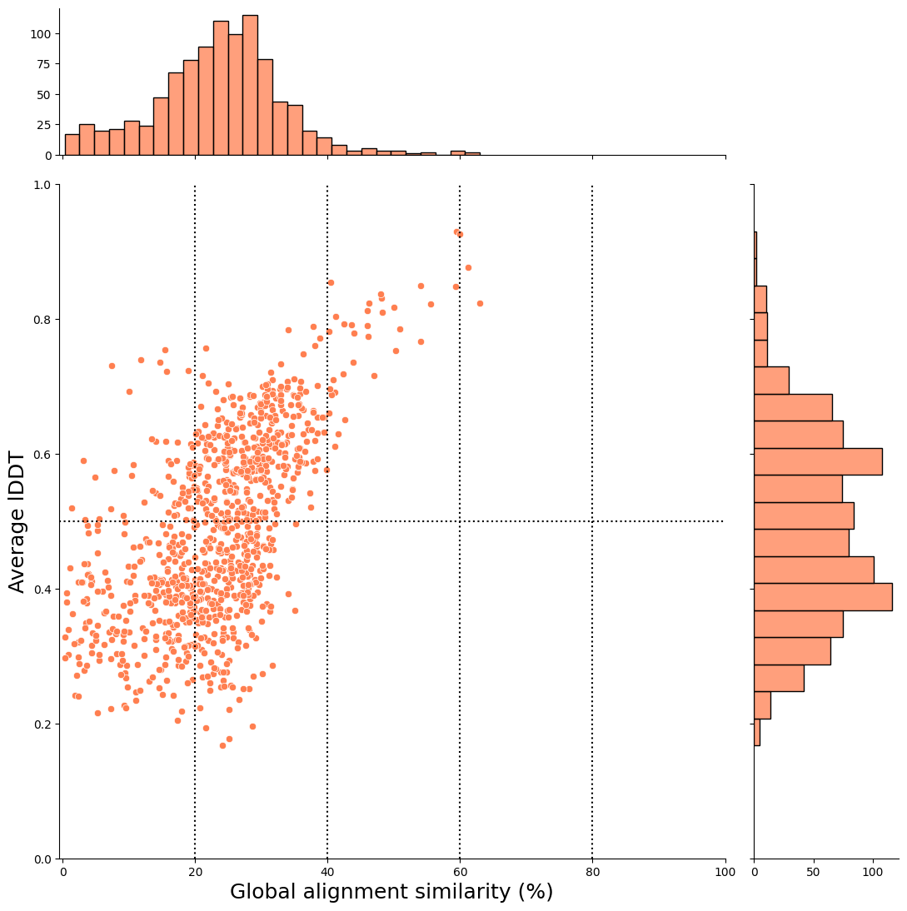
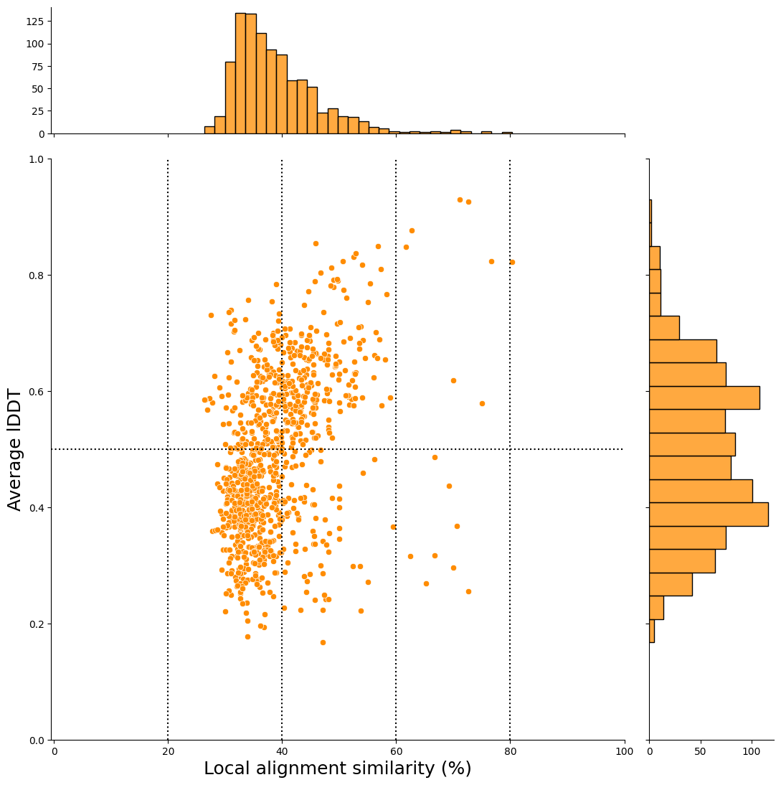

# Glycine Max 100 Genes Test 🫘 ↔ 🕺

This directory contains the test results for running the plant2human workflow with *Solanum lycopersicum* (tomato) genes.

**Test Date:** 2025-12-13

---

## 📊 Dataset Overview

| Item | Value |
|------|-------|
| **Species** | *Glycine Max* |
| **Input genes** | 100 randomly selected genes (Ensembl plants release 62) |
| **Workflow** | `plant2human_v3_stringent.cwl` |
| **Target species** | *Homo sapiens* (Human) |
| **Proteome** | [UP000005640](https://www.uniprot.org/proteomes/UP000005640) |
| **AFDB version** | v6 |

---

&nbsp;

## 📁 Directory Structure

```bash
tree -L 1
.
├── README.md
├── blastdbcmd_result_hit_species.fasta
├── blastdbcmd_result_hit_species.log
├── blastdbcmd_result_query_species.fasta
├── blastdbcmd_result_query_species.log
├── foldseek_gm_100genes_9606_stringent.tsv
├── foldseek_hit_species_togoid_convert_stringent.tsv
├── foldseek_output_human_proteome_v6_gm_100genes_evalue01_stringent.tsv
├── foldseek_result_hit_species_stringent.txt
├── foldseek_result_query_species_stringent.txt
├── glycine_max_100_genes_uniprot_idmapping.ipynb
├── glycine_max_random_100genes_list.tsv
├── gm_100_genes_afinfo_json/ # add .gitignore
├── gm_100_genes_idmapping_all.tsv
├── gm_100_genes_mmcif/ # add .gitignore
├── gm_100_genes_plant2human_report_stringent.ipynb
├── result_needle/ # add .gitignore
├── result_water/ # add .gitignore
├── split_fasta_hit_species/ # add .gitignore
└── split_fasta_query_species/ # add .gitignore

6 directories, 14 files
```

&nbsp;

## How to Reproduce

### Step 1: UniProt ID Mapping

```bash
# test date: 2025-12-13
cwltool --debug --outdir ./test/glycine_max_test_100genes_202512/ \
./Tools/01_uniprot_idmapping.cwl \
./job/gm_100genes_uniprot_idmapping.yml
```

&nbsp;

### Step 2: Main Workflow (Stringent Mode)

```bash
# test date: 2025-12-13
cwltool --debug --outdir ./test/glycine_max_test_100genes_202512/ \
./Workflow/plant2human_v3_stringent.cwl \
./job/plant2human_v3_stringent_example_gm100.yml
```

---

&nbsp;

## Structural Alignment vs Sequence Alignment (global alignment)



&nbsp;

## Structural Alignment vs Sequence Alignment (local alignment)



&nbsp;

## 📚 Related Files

- **YAML parameter file:** [`../../job/plant2human_v3_stringent_example_gm100.yml`](../../job/plant2human_v3_stringent_example_sl100.yml)
- **Main README:** [`../../README.md`](../../README.md)
- **Workflow:** [`../../Workflow/plant2human_v3_stringent.cwl`](../../Workflow/plant2human_v3_stringent.cwl)

---