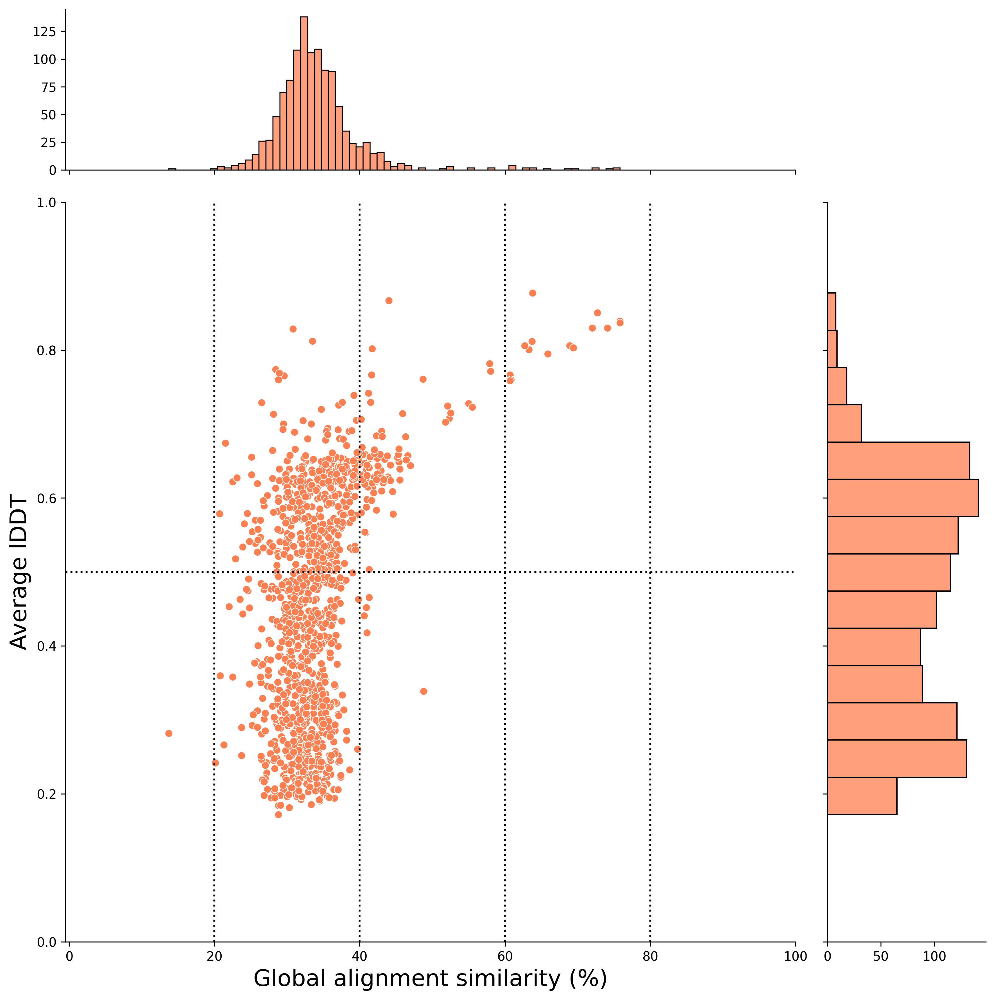
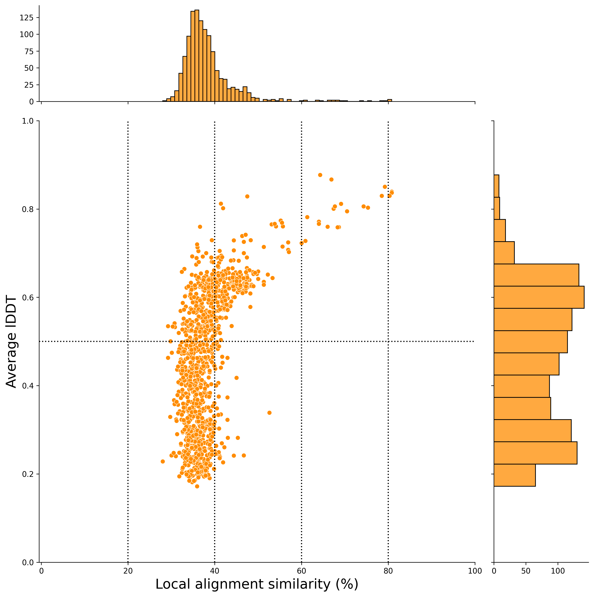

# Solanum lycopersicum 100 Genes Test 🍅 ↔ 🕺

This directory contains the test results for running the plant2human workflow with *Solanum lycopersicum* (tomato) genes.

**Test Date:** 2025-03-24

---

## 📊 Dataset Overview

| Item | Value |
|------|-------|
| **Species** | *Solanum lycopersicum* |
| **Input genes** | 100 randomly selected genes (Ensembl plants release 62) |
| **Workflow** | `plant2human_v3_stringent.cwl` |
| **Target species** | *Homo sapiens* (Human) |
| **Target Proteome** | [UP000005640](https://www.uniprot.org/proteomes/UP000005640) |
| **AFDB version** | v6 |

---

&nbsp;

## 📁 Directory Structure

```bash
tree -L 1

.
├── blastdbcmd_result_query_species.fasta
├── blastdbcmd_result_query_species.log
├── blastdbcmd_result_target_species.fasta
├── blastdbcmd_result_target_species.log
├── foldseek_hit_species_togoid_convert.tsv
├── foldseek_result_gene_level_hit_count_all.tsv
├── foldseek_result_join_alignment_result_all.tsv # <- all result TSV file
├── foldseek_result_join_alignment_result_filter.tsv
├── foldseek_result_pident_lddt.png
├── foldseek_result_query_species.txt
├── foldseek_result_similarity_percent_needle_lddt_all.png
├── foldseek_result_similarity_percent_needle_lddt_filter.png
├── foldseek_result_similarity_percent_water_lddt_all.png
├── foldseek_result_similarity_percent_water_lddt_filter.png
├── foldseek_result_target_species.txt
├── plant2human_report.ipynb # <- Report notebook is here!
├── README.md # This file!
├── result_needle/ # add .gitignore
├── result_water/ # add .gitignore
├── sl_100_genes_afinfo_json/ # add .gitignore
├── sl_100_genes_idmapping_all.tsv
├── sl_100_genes_mmcif/ # add .gitignore
├── solanum_lycopersicum_100_genes_uniprot_idmapping.ipynb
├── solanum_lycopersicum_random_100genes_list.tsv
├── split_fasta_query_species/ # add .gitignore
└── split_fasta_target_species/ # add .gitignore

6 directories, 20 files
```

&nbsp;

## How to Reproduce

### Step 1: UniProt ID Mapping

```bash
# test date: 2025-12-13
cwltool --debug --outdir ./test/solanum_lycopersicum_test_100genes_202512/ \
./Tools/01_uniprot_idmapping.cwl \
./job/sl_100genes_uniprot_idmapping.yml
```

&nbsp;

### Step 2: Main Workflow (Stringent Mode)

```bash
# test date: 2026-03-24
cwltool --debug --outdir ./test/solanum_lycopersicum_test_100genes_202603/ \
./Workflow/plant2human_v3_stringent.cwl \
./job/plant2human_v3_stringent_example_sl100.yml
```

---

&nbsp;

## Structural Alignment vs Sequence Alignment (global alignment)



&nbsp;

## Structural Alignment vs Sequence Alignment (local alignment)



&nbsp;

## 📚 Related Files

- **YAML parameter file:** [`../../job/plant2human_v3_stringent_example_sl100.yml`](../../job/plant2human_v3_stringent_example_sl100.yml)
- **Main README:** [`../../README.md`](../../README.md)
- **Workflow:** [`../../Workflow/plant2human_v3_stringent.cwl`](../../Workflow/plant2human_v3_stringent.cwl)

---